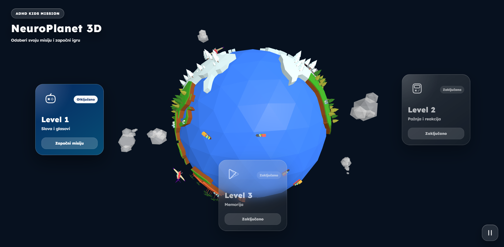

# NeuroPlanet 3D

Interactive 3D educational game prototype designed to support children with ADHD through playful cognitive exercises.



## Overview

NeuroPlanet 3D combines a 3D environment, progressive levels and simple game mechanics to support:

- Letter and sound recognition  
- Attention and reaction training  
- Memory exercises  
- Focus through guided interaction  

## Levels

**Level 1**  
Letters and Sounds

**Level 2**  
Attention and Reaction

**Level 3**  
Memory

Levels unlock through progression.

## Features

- Interactive 3D planet with Three.js  
- Pause and resume model controls  
- ADHD-friendly interface design  
- Animated level cards  
- Locked-level feedback modal  
- Responsive layout for desktop and mobile  

## Stack

- HTML  
- CSS  
- JavaScript  
- Vite  
- Three.js  
- GLTFLoader  
- OrbitControls  

## Run Project

```bash
git clone https://github.com/Armin-000/ADHD_game.git
cd ADHD_game
npm install
npm run dev
```

Build:

```bash
npm run build
```

## Project Structure

```bash
src/
├── main.js
├── style.css
├── index.html
├── level1.html
├── level2.html
└── level3.html
```

## Goal

The project explores how interactive 3D environments can support:

- Focus  
- Cognitive stimulation  
- Motivation  
- Task persistence  

## Roadmap

- Progress saving  
- Audio guidance  
- Mini-games  
- Reward system  
- Parent dashboard  

## Author

Armin Lišić

Student project and experimental prototype.

## License

MIT License