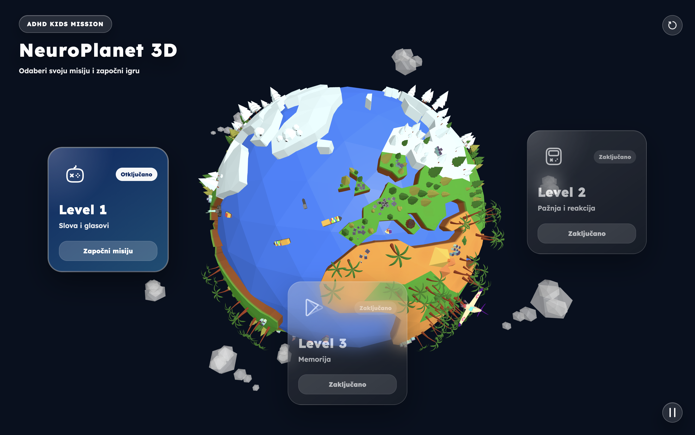

# NeuroPlanet 3D 🌍

Interactive 3D educational experience designed to support children with ADHD through playful cognitive exercises, positive feedback and immersive interaction.



---

# Overview

NeuroPlanet 3D combines:
- 🌌 Interactive 3D world
- 🎮 Educational mini games
- 🧠 ADHD-friendly UX principles
- ✨ Visual and audio feedback systems

The project focuses on helping children improve:
- letter and sound recognition
- attention and reaction
- memory
- focus and task persistence
- motivation through play

---

# Levels

## 🔤 Level 1 — Letters & Sounds
Children listen to a sound and select the correct word that begins with that letter.

Features:
- speech synthesis
- scoring system
- mistake tracking
- progression system

---

## 🧩 Level 2 — Syllables & Words
Children combine syllables to complete words.

Features:
- word construction
- cognitive association
- scoring and analytics
- responsive UI

---

## 🪐 Level 3 — Planet Memory
Memory card matching system with adjustable difficulty.

Features:
- memory training
- ADHD-friendly pacing
- difficulty system
- hint system
- timing analytics

---

# Analytics & Teacher Dashboard 📊

NeuroPlanet 3D includes a hidden analytics dashboard designed for:
- teachers
- speech therapists
- parents

The dashboard displays:
- level scores
- completion time
- difficulty level
- accuracy
- total progress

---

# Hidden Dashboard Access 🔐

## macOS

```txt
COMMAND + OPTION + R
````

## Windows / Linux

```txt
CTRL + ALT + R
```

Opens:

```txt
results.html
```

---

# Features ✨

* 🌍 Interactive 3D planet using Three.js
* 🎮 Progressive educational levels
* 🔓 Level unlock system
* 📊 Result analytics dashboard
* ⭐ Score tracking system
* ⏱️ Completion time tracking
* 🧠 ADHD-friendly UX design
* ✨ Glassmorphism UI
* 🔊 Audio feedback system
* 🎉 Victory effects & animations
* 📱 Responsive desktop/mobile layout
* ⚙️ Difficulty system
* 💾 Local progress saving using localStorage

---

# ADHD-Friendly UX Principles 🧠

The project follows several ADHD-oriented design principles:

* minimal UI clutter
* large interactive elements
* short and focused tasks
* immediate feedback
* smooth animations
* guided pacing
* reduced cognitive overload

---

# Tech Stack ⚙️

* HTML5
* CSS3
* JavaScript
* Vite
* Three.js
* GLTFLoader
* OrbitControls
* Web Audio API
* Speech Synthesis API

---

# Run Project 🚀

Clone repository:

```bash
git clone https://github.com/Armin-000/ADHD_game.git
```

Enter project:

```bash
cd ADHD_game
```

Install dependencies:

```bash
npm install
```

Run development server:

```bash
npm run dev
```

---

# Build Project

```bash
npm run build
```

---

# Project Structure 📁

```bash
project/
├── index.html
├── results.html
├── level1.html
├── level2.html
├── level3.html
│
├── src/
│   ├── main.js
│   ├── style.css
│   │
│   ├── JS/
│   │   ├── level1.js
│   │   ├── level2.js
│   │   ├── level3.js
│   │   └── results.js
│   │
│   ├── CSS/
│   │   ├── level1.css
│   │   ├── level2.css
│   │   ├── level3.css
│   │   └── results.css
```

---

# Result Tracking System 📈

The application tracks:

* score per level
* wrong attempts
* level duration
* selected difficulty
* total statistics

Results are stored locally using:

```js
localStorage
```

---

# Current Systems ✅

* ✔️ 3D planet hub
* ✔️ Warp transition system
* ✔️ Level progression
* ✔️ Analytics dashboard
* ✔️ Score system
* ✔️ Difficulty system
* ✔️ Memory game
* ✔️ Speech synthesis
* ✔️ Sound effects
* ✔️ Victory animations
* ✔️ Responsive layouts

---

# Future Roadmap 🚀

* 👤 Multiple child profiles
* ☁️ Cloud save system
* 📄 PDF reports for therapists
* 📊 Progress charts
* 🏆 Achievement system
* 🎙️ Voice guidance
* 🌌 More planets and levels
* 🧠 Adaptive difficulty AI

---

# Goal 🎯

The goal of NeuroPlanet 3D is to explore how:

* interactive 3D environments
* playful educational mechanics
* ADHD-friendly UX design

can improve:

* focus
* engagement
* cognitive stimulation
* motivation in children

---

# Author 👨‍💻

Armin Lišić

Student project and experimental educational prototype.

---

# License 📄

MIT License